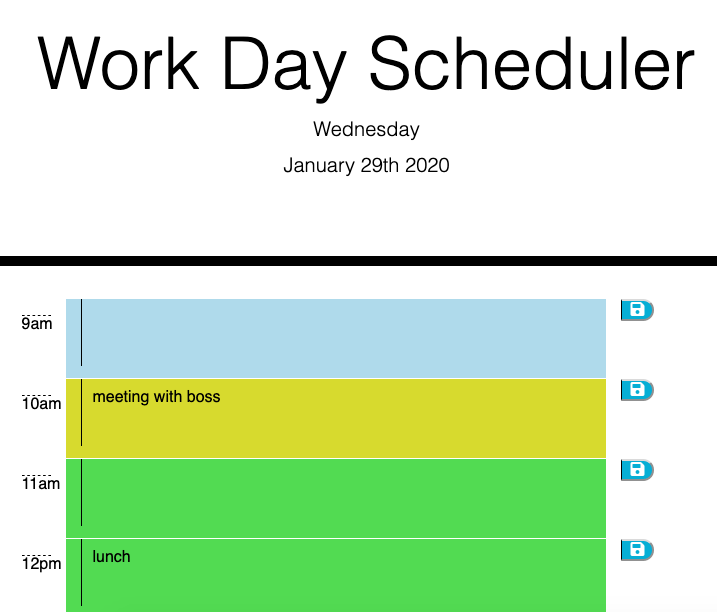

# Homework 5: Creating a Work Day Scheduler 

This is the homework for the 05 Third-Party APIs unit.   
This project uses the Moment.js library.

* Files Included in this project
    * index.html
    * style.css
    * script.js
    * README 
    * assets

# The Project

AS AN employee with a busy schedule  

I WANT to add important events to a daily planner  

SO THAT I can manage my time effectively  

# How to use this work day scheduler

* load in browser, you will see date displayed at the top
* work hours are displayed from 9am to 5pm
* write your memo in the hour needed and press the save button to store memo
* blocks that are light blue are in the past
* blocks that are yellow are in the present
* blocks that are green are in the future

## Link to live scheduler is [here](https://gabymag.github.io/H5DayPlanner/)

